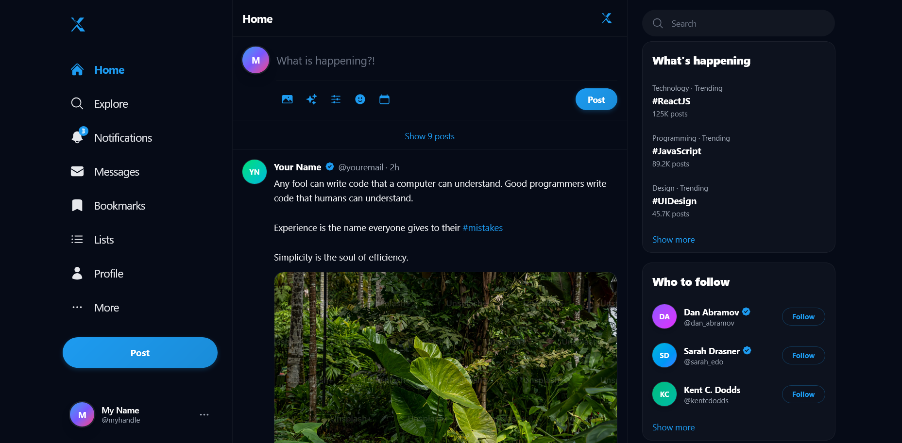

# Twitter Clone

A Twitter-like application built with React and Vite.

## Features

- Responsive design
- Modern UI components
- Real-time updates

## Project Structure

- `src/components/` - React components (Left, Middle, Right)
- `src/assets/` - Static assets and images
- `public/` - Public assets

## Output Preview



## Getting Started

1. Install dependencies:

   ```bash
   npm install
   ```

2. Run the development server:

   ```bash
   npm run dev
   ```

3. Build for production:
   ```bash
   npm run build
   ```

## Technologies Used

- React
- Vite
- CSS

---

Built with ❤️
